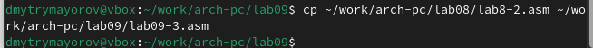
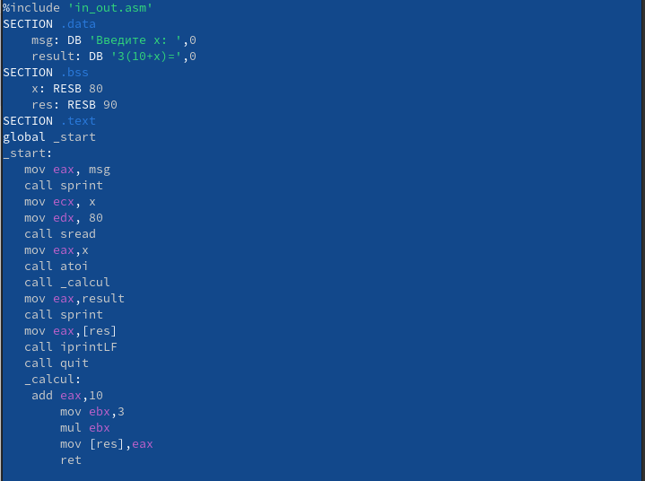

---
## Front matter
title: "Отчёт по лабораторной работе №9"
subtitle: "Понятие подпрограммы.Отладчик GBD"
author: "Майоров Дмитрий Андреевич"

## Generic otions
lang: ru-RU
toc-title: "Содержание"

## Bibliography
bibliography: bib/cite.bib
csl: pandoc/csl/gost-r-7-0-5-2008-numeric.csl

## Pdf output format
toc: true # Table of contents
toc-depth: 2
lof: true # List of figures
lot: true # List of tables
fontsize: 12pt
linestretch: 1.5
papersize: a4
documentclass: scrreprt
## I18n polyglossia
polyglossia-lang:
  name: russian
  options:
	- spelling=modern
	- babelshorthands=true
polyglossia-otherlangs:
  name: english
## I18n babel
babel-lang: russian
babel-otherlangs: english
## Fonts
mainfont: IBM Plex Serif
romanfont: IBM Plex Serif
sansfont: IBM Plex Sans
monofont: IBM Plex Mono
mathfont: STIX Two Math
mainfontoptions: Ligatures=Common,Ligatures=TeX,Scale=0.94
romanfontoptions: Ligatures=Common,Ligatures=TeX,Scale=0.94
sansfontoptions: Ligatures=Common,Ligatures=TeX,Scale=MatchLowercase,Scale=0.94
monofontoptions: Scale=MatchLowercase,Scale=0.94,FakeStretch=0.9
mathfontoptions:
## Biblatex
biblatex: true
biblio-style: "gost-numeric"
biblatexoptions:
  - parentracker=true
  - backend=biber
  - hyperref=auto
  - language=auto
  - autolang=other*
  - citestyle=gost-numeric
## Pandoc-crossref LaTeX customization
figureTitle: "Рис."
tableTitle: "Таблица"
listingTitle: "Листинг"
lofTitle: "Список иллюстраций"
lotTitle: "Список таблиц"
lolTitle: "Листинги"
## Misc options
indent: true
header-includes:
  - \usepackage{indentfirst}
  - \usepackage{float} # keep figures where there are in the text
  - \floatplacement{figure}{H} # keep figures where there are in the text
---

# Цель работы

Приобретение навыков написания программ с использованием подпрограмм. Знакомство с методами отладки при помощи GDB и его основными возможностями.

# Выполнение лабораторной работы

Различия отображения синтаксиса машинных команд в режимах ATT и Intel:
1.Порядок операндов: В ATT синтаксисе порядок операндов обратный, сначала указывается исходный операнд, а затем - результирующий операнд. В Intel син- таксисе порядок обычно прямой, результирующий операнд указывается первым, а исходный - вторым.
2.Разделители: В ATT синтаксисе разделители операндов - запятые. В Intel синтаксисе разделители могут быть запятые или косые черты (/).
3.Префиксы размера операндов: В ATT синтаксисе размер операнда указывается перед операндом с использованием префиксов, таких как “b” (byte), “w” (word), “l” (long) и “q” (quadword). В Intel синтаксисе размер операнда указывается после операнда с использованием суффиксов, таких как “b”, “w”, “d” и “q”.
4.Знак операндов: В ATT синтаксисе операнды с позитивными значениями предваряются символом “". "”.
5.Обозначение адресов: В ATT синтаксисе адреса указываются в круглых скобках. В Intel синтаксисе адреса указываются без скобок.
6.Обозначение регистров: В ATT синтаксисе обозначение регистра начинается с символа “%”. В Intel синтаксисе обозначение регистра может начинаться с символа “R” или “E” (например, “%eax” или “RAX”).

Во время выполнения команд менялись регистры: ebx, ecx, edx,eax, eip.

Выводится разные значения, так как команда без кеавычек присваивает регистру вводимое значение.

Шаг изменения адреса равен 4 потому что адресные регистры имеют размерность 32 бита(4 байта).

# Задание для самостоятельной работы

Задание 1

Задание 2

# Выводы

Мы познакомились с методами отладки при помощиGDBи его возможностями.

# Список литературы{.unnumbered}

::: {#refs}
:::
